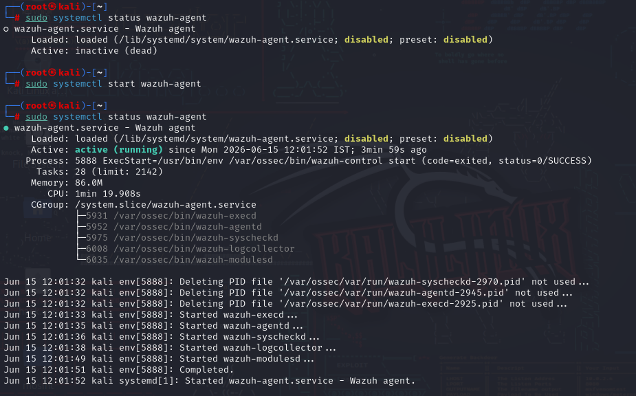
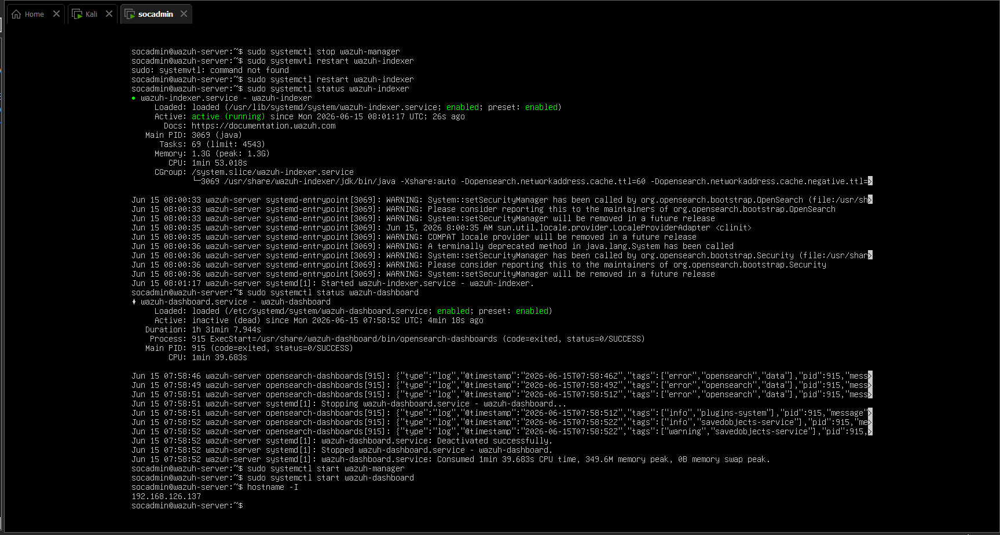
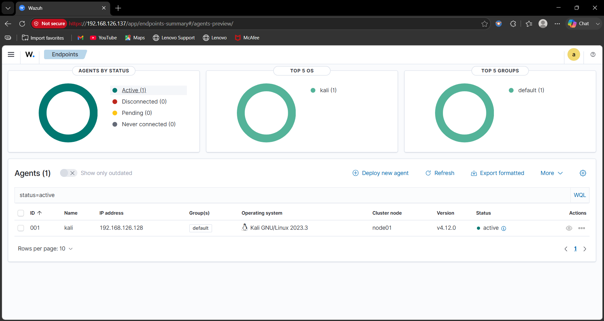
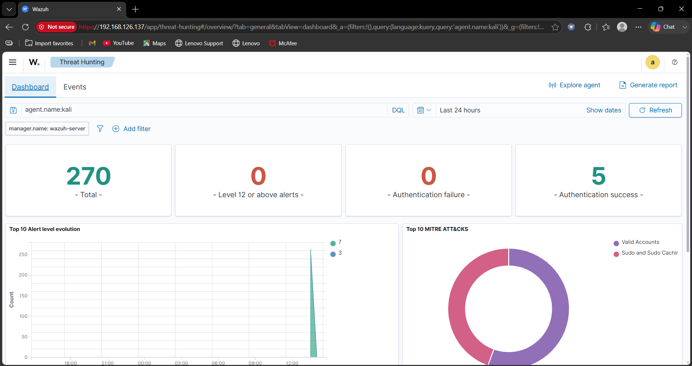

# Wazuh SIEM Home Lab

## Project Overview

This project demonstrates the deployment and configuration of a Wazuh SIEM Home Lab using Ubuntu Server and Kali Linux in VMware.

The lab was built to simulate a Security Operations Center (SOC) environment for monitoring, log collection, threat hunting, and security event analysis.

---

## Lab Architecture

- Wazuh Manager: Ubuntu Server
- Wazuh Agent: Kali Linux
- Virtualization Platform: VMware Workstation
- SIEM Platform: Wazuh
- Communication: Agent-to-Manager Monitoring

---

## Objectives

- Deploy Wazuh Manager
- Configure and connect Wazuh Agent
- Monitor endpoint activity
- Generate security events
- Perform threat hunting
- Analyze alerts through Wazuh Dashboard

---

## Technologies Used

- Wazuh SIEM
- Ubuntu Server
- Kali Linux
- VMware Workstation
- Linux CLI

---

## Skills Demonstrated

- SIEM Deployment
- Security Monitoring
- Log Analysis
- Threat Hunting
- Linux Administration
- Incident Detection
- Agent Management

---

## Screenshots

### Kali Agent Running

### Ubuntu Wazuh Manager Running

### Active Agents

### Threat Hunting Events

### Dashboard Overview

---

## Outcome

Successfully deployed a functional Wazuh SIEM environment with an Ubuntu-based Wazuh Manager and a Kali Linux endpoint agent. The environment was used to monitor events, collect logs, and perform basic threat hunting activities.
